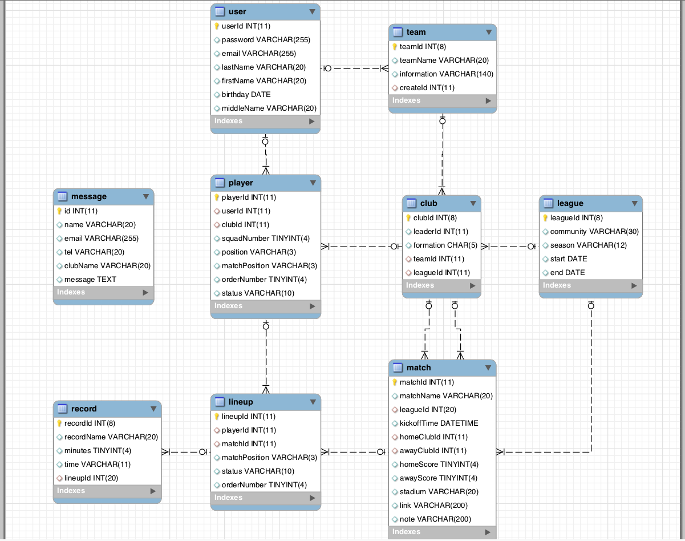

# 공찰래리그 player

## 공찰래리그란?

2011년부터 시작된 경기 여주지역의 아마추어 리그다.

현재 2014시즌은 승성회의 우승으로 끝이나고 2015시즌을 준비중이다.

[facebook page](https://www.facebook.com/shallwefootball)

[facebook group yeoju](https://www.facebook.com/groups/shallwefootball.yeoju/)

## 공찰래리그 player 이란?
공찰래리그의 경기기록을 효율적으로 관리하기위해 개발이 되었다.

경기운영과 기록에 관한 개발은 마무리된 상태이며 사용자 권한 등 여러가지의 이슈가 남아있는 상태이다.

## 설치

누구든 공찰래리그 player을 설치, 사용할 수 있으며 공찰래리그와 같은 시스템의 리그를 개최하고 관리할 수 있다.

1. nodejs & mysql이 설치되어있어야 합니다.
2. 저장소 가져오기 : `$ git clone https://github.com/shallwefootball/web_player.git`
3. db 생성 : `db.sql`을 import한다.
4. module 설치 : `$ cd web_admin && npm install`
5. 사용자 설정 : `$ mv ./app/config/user-config.js ./app/config/config.js`
6. 서버시작 : `$ node server.js`

### global client plugin
- [bootstrap3 yeti theme](http://bootswatch.com/yeti/) - Yeti. A friendly foundation.
- [jQuery UI Touch Punch](http://touchpunch.furf.com/) - Touch Event Support for jQuery UI. Tested on iPad, iPhone, Android and other touch-enabled mobile devices.

### specific client plugin
- [bootstrapvalidator](http://bootstrapvalidator.com/) - Best jQuery plugin to validate form fields. Designed to use with Bootstrap 3+

### 기능소개
- 선수로그인
- 선수등록(회원가입)
- 선수정보와 개인기록 열람.
- 이적기간

- 리더권한
	- 지난시즌의 리더가 준비중인 리그에 기존선수들과함께 참가 할 수있음
	- 리더 승계
	- 리그에서 불참할 수 있음
	- 새로운선수추가(기존에 있는선수가 아니라 새로운선수)
	- 소속팀 등번호, 포지션 수정가능
	- 소속팀 선수를 탈퇴시킬 수 있음(재가입시키려면 러브콜을 보내야 함)
	- 포메이션설정
	- 경기기록

- 선수검색
	- 선수 본인의 포메이션과 등번호 수정가능(단, 리그시작전만 가능)
	- 이름이나 성으로 검색
	- 최근에 뛰었던 소속팀
	- 현재 본인이 소속팀이 있다면 러브콜을 보내서 초대할 수 있음(단, 같은리그에 다른소속팀이 되어있는 선수는 러브콜을 보낼 수 없음)

- 일반선수
	- 러브콜을 받게되고 수락하게되면 러브콜받은 팀에 가입
	- (러브콜)거절가능
	- 입단하고 싶은 팀에 입단요청을 보낼 수 있음

- 개발계획
	- 이메일 변경
	- 생일설정
	- 비번재설정
	- 프로필사진업로드

